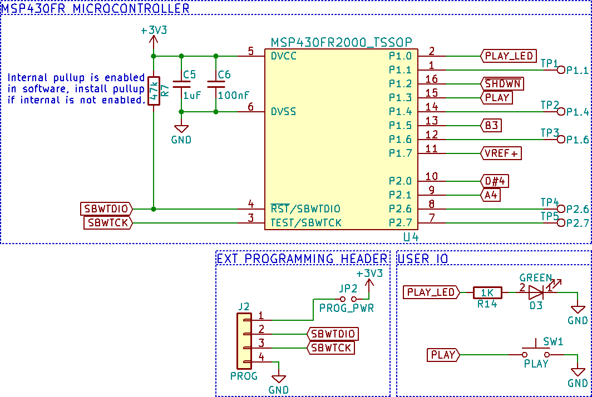

# Train Horn Synthesis with the MSP430FR2000
Link to blog post

## Introduction
The hardware and code presented is designed to simulate the sound of a train horn (or come as close as possible with the given hardware). Specifically is is designed to synthesize the sound of a [Leslie S-3L Locomotive Air Horn](http://www.dieselairhorns.com/sounds/LeslieS3L.mp3).

The final design is battery powered for portability. It uses a 18650 LiPo cell and features an onboard charger using a standard micro USB port and a low battery indicator LED.

The circuitry is able to drive a standard speaker load of 8-4Ω for mono sound. Four adjustable gain settings of 4, 8, 12, and 16 are available for setting the output volume of the audio amplifier with minimal modifications.

An onboard microcontroller generates the chord and enables the user control of the sound though a simple push button. The [MSP430FR2000](http://www.ti.com/product/MSP430FR2000) was chosen due to its low cost in single quantities and availability at the time of designing this product. The MSP430 line was chosen specifically to develop a familiarity with using the product.

## A Brief Overview

A 4-8Ω speaker is connected to the speaker terminal. The device is powered from a 18650 LiPo cell which is charged using the micro USB port, a blue LED indicates that the battery is charging. The charging circuitry is capable of charging the battery at a maximum current of 500mA.  The low battery detection circuitry will illuminate a red LED indicator light when the battery voltage is low and requires charging. The audio amplifier gain (volume) is configured using jumpers JP3-JP8 and is set to 16 by default. Pressing and holding either the small SMD or the larger right angle play button generates sound. A green LED is illuminated while sound is playing. Releasing the button stops sound generation.

## Schematic

## Detailed Description
### Sound Generation
The Leslie S-3L Locomotive Air Horn generates its distinctive [sound](http://www.dieselairhorns.com/sounds/LeslieS3L.mp3) using a three tone chord of approximately C, D#, and A [http://atsf.railfan.net/airhorns/s3l.html](http://atsf.railfan.net/airhorns/s3l.html).

The onboard microcontroller generates the chord using three 50% duty cycle PWM signals. Since the MSP430FR2000 microcontroller has only one general purpose timer the method outlined in TI app note [SLAA513A](http://www.ti.com/lit/an/slaa513a/slaa513a.pdf) was implemented to generate multiple time bases on a single MSP430 timer module. This enables use of the lower cost MSP430FR2000 instead of having to move to a potentially higher cost MSP430 microcontroller with three separate timer modules.

Each PWM signal from the microcontroller is passed through a three stage RC low pass filter to produce a sine wave on the output.  The RC low pass filter was designed with the help of the following online RC low pass filter calculator: [http://sim.okawa-denshi.jp/en/CRtool.php](http://sim.okawa-denshi.jp/en/CRtool.php)

After each PWM signal is converted to a sine wave the signals are then mixed together before entering the audio amplifier. The audio amplifier is a [TPA6211A1](http://www.ti.com/lit/ds/symlink/tpa6211a1.pdf) mono audio power amplifier. The audio amplifier has 4 adjustable gain settings that can be changed by desoldering the smd jumpers (JP3 to JP6) as indicated by the table. For example to set a gain of eight JP4, JP5, JP6, and JP7 would be removed from the PCB. The amplifier can drive a 4-8Ω speaker.

### Battery Circuitry
The circuit is powered with a standard 18650 LiPo cell. Be sure to observe polarity of the battery holder. The positive end of the battery installs opposite of the speaker terminal. Installing the battery in reverse polarity will destroy the battery charger IC and will damage the remaining circuitry. Don't ask me how I know.

Charging is controlled by the [MCP73831](https://www.microchip.com/wwwproducts/en/en024903) charge management IC at a maximum charging current of 500mA using the micro USB port. This USB port if for charging only, the data lines are not connected to the MSP430FR2000 microcontroller. A blue LED indicator is turned on while the battery charges. The LED turns off to indicate that the battery is fully charged.

A red LED is used to indicate a low battery voltage. The [MIC7221](http://ww1.microchip.com/downloads/en/DeviceDoc/mic7211.pdf) comparator is used to illuminate the LED when the battery voltage drops below ~3.3V. The internal 1.2V reference from the microcontroller is used as the voltage reference for the comparator.

The onboard comparator of the MSP430FR2000 was not used due to issues with getting it to function correctly, most likely error on my part. To save time and frustration an external comparator was used instead.

The MSP430FR2000 microcontroller has a maximum voltage supply rating of 3.6V requiring a 3.3V low dropout regulator to prevent a fully charged LiPo cell voltage of 4.2V damaging the microcontroller. SMD JP1 can be desoldered from the circuit to put the LDO in shutdown mode, turning off the microcontroller.

### Firmware
The microcontroller spends much of its time in a low power sleep mode, the full circuit draws about 0.3mA of quiescent current. A 1600mAh LiPo cell will have a standby life of over [3700 hours](https://www.digikey.com/en/resources/conversion-calculators/conversion-calculator-battery-life) or 154 days!

Sound is generated when the user presses and holds down the play button. There are two play buttons on the PCB, a small SMD button and a friendlier medium sized right angle button. The PCB was originally designed to use only the SMD button but a last minute change added the right angle through hole button. Both are populated to allow multiple options of triggering sound generation. The green LED indicator is used to indicate when the sound is being generated.

Firmware is avalible here: [firmware/train_horn_hold/train_horn_hold.c](firmware/train_horn_hold/train_horn_hold.c)
